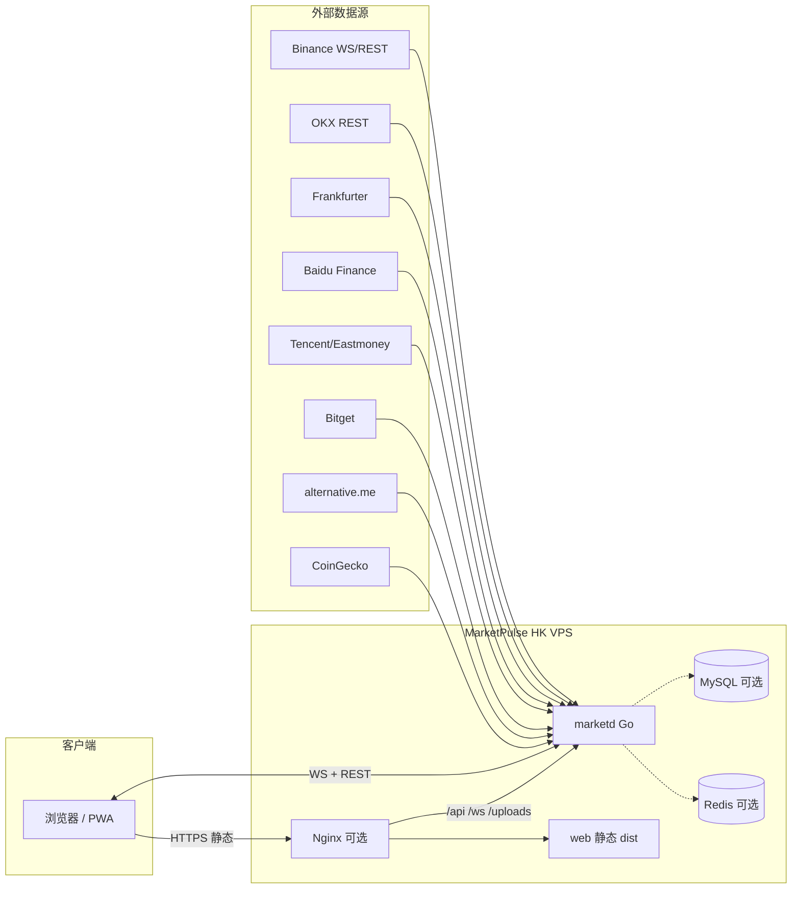
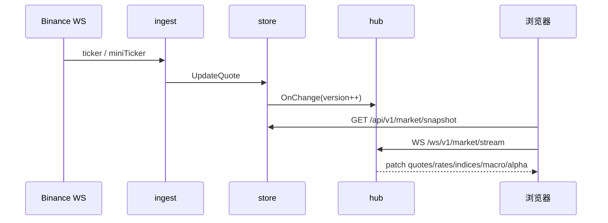
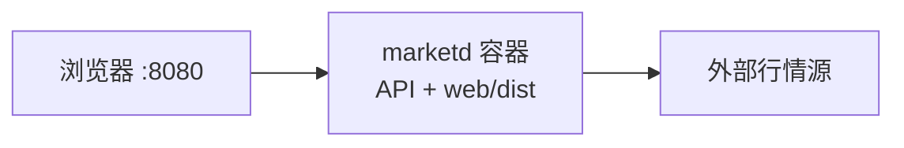

# RFC-001：MarketPulse 整体架构设计

| 字段 | 内容 |
|------|------|
| 状态 | Accepted |
| 作者 | — |
| 日期 | 2026-05-16 |
| 最后对齐 | 2026-07-22 |
| 适用范围 | marketpulse 全栈（后端 marketd + 前端 web） |

---

## 1. 背景与目标

### 1.1 背景

旧系统（`go-coin-master` + `mine-web-master`）通过定时 REST 拉取火币行情写入 Redis，PHP 页面每秒轮询接口读缓存，存在延迟高、数据源脆弱、双服务维护成本高等问题。

### 1.2 目标

构建个人用加密货币行情看板 **MarketPulse**，满足：

1. **核心体验**：实时币价、汇率、股指、宏观指标（恐惧贪婪、总市值等）。
2. **技术升级**：币价经 **WebSocket 长连接** 入站，内存聚合后 **WebSocket/SSE** 推送前端，告别「REST → Redis → 轮询」。
3. **工程约束**：
   - **单一 Git 仓库**，目录区分前后端；
   - **前后端可独立构建、独立部署**（改前端不必强制重编后端）；
   - 适配 **Vibe Coding**（个人项目、AI 辅助迭代、约定清晰、文件边界明确）。

### 1.3 非目标 / 已实现扩展

**初版非目标（仍不做）：**

- 公开自助注册（仅 seed 账号 / 运维开户）
- 留言板、收藏夹等旧站次要能力
- 复刻 AiCoin / 非小号等非公开爬虫数据源
- AI 分析助手（`ai` 模块仍为规划）

**已实现业务扩展（灰度开关，默认关）：**

- 用户中心：登录、资料、头像、改密（`users` + MySQL/Redis）
- 价格告警：规则评测 + 站内 / 邮箱 / PushPlus（`alerts`）
- 资产中心：持仓估值、日快照、报告图表（`portfolio`）

---

## 2. 设计原则

| 原则 | 说明 |
|------|------|
| **单仓双端** | 一个 repo：`/cmd` + `/internal` 为后端，`/web` 为前端 |
| **部署解耦** | 生产默认 **静态资源与 API 进程分离**；亦支持 **单二进制 embed** 一键部署 |
| **实时优先** | 币价路径：交易所 WS → 内存 Store → 客户端 WS |
| **慢数据 REST** | 股指、汇率、宏观指标按分钟级 REST 拉取即可 |
| **可观测** | `/healthz` 暴露各 ingest 连接状态 |
| **Vibe 友好** | 目录浅、命名一致、RFC/接口契约集中、Makefile 一键命令 |

---

## 3. 系统上下文



---

## 4. 逻辑架构

### 4.1 后端（marketd）

```
┌─────────────────────────────────────────────────────────┐
│ cmd/marketd                                              │
├─────────────────────────────────────────────────────────┤
│ internal/marketdata           行情服务门面                  │
│ internal/marketdata/ingest    数据采集（WS + REST 轮询）     │
│ internal/marketdata/store     内存行情快照（线程安全）        │
│ internal/marketdata/stream    WebSocket 广播 + K 线订阅     │
│ internal/marketdata/marketcenter  行情中心按需 API          │
│ internal/users               登录 / 资料 / 会话（可选）      │
│ internal/alerts              价格告警评测与投递（可选）       │
│ internal/portfolio           持仓 / 快照 / 报告（可选）      │
│ internal/platform            MySQL / Redis / migrate / upload│
│ internal/api                 REST / WS handlers            │
│ internal/server              Gin 引擎、CORS、静态资源       │
│ internal/config              配置加载（YAML + 环境变量）    │
│ internal/logging             日志目录初始化                 │
└─────────────────────────────────────────────────────────┘
```

**数据流：**



### 4.2 前端（web）

```
┌─────────────────────────────────────────────────────────┐
│ web/ (Vue 3 + Vite 6 + TypeScript + Pinia)              │
├─────────────────────────────────────────────────────────┤
│ src/features/market/   看板、行情中心、快讯、K 线            │
│ src/features/auth/     登录 / 用户中心                      │
│ src/features/alerts/   规则 / 投递记录 / Toast WS           │
│ src/features/portfolio/ 资产中心（总览 / 报告）             │
│ src/stores/theme.ts    深浅色主题                           │
│ src/App.vue            挂载全局 AlertToastHost              │
└─────────────────────────────────────────────────────────┘
```

**数据流：**

1. 挂载 → `GET /api/v1/market/snapshot` 填充首屏；
2. 连接 `WS /ws/v1/market/stream?channels=quotes,rates,indices,alpha,macro`；
3. 按 `type` + `version` 增量更新 Pinia；
4. 断线 → 指数退避重连 → 5s 无数据降级 mock 演示；
5. 行情中心独立 REST 轮询（60s），不走全局 WS；
6. 登录后连接 `WS /ws/v1/alerts/stream`；资产总览约 5s REST 轮询。

---

## 5. 仓库结构（Monorepo）

```
marketpulse/
├── README.md                 # 项目入口说明
├── Makefile                  # 统一构建/部署命令（含 docker-*）
├── Dockerfile                # 多阶段镜像（前端 + marketd）
├── docker-compose.yml        # Compose；profile db = MySQL/Redis
├── .gitignore
├── go.mod
├── config/
│   ├── config.example.yaml   # 本机配置模板
│   └── config.docker.yaml    # 容器默认配置
├── cmd/
│   ├── marketd/
│   │   └── main.go           # 进程入口
│   └── migrate-assets-log/   # 旧 assets_log → portfolio 迁移 CLI
├── internal/                 # 后端私有包（不对外 import）
│   ├── config/
│   ├── logging/
│   ├── platform/             # mysql / redis / migrate / upload
│   ├── marketdata/
│   │   ├── ingest/         # 数据采集（binance/baidu/equity/macro/metals/...）
│   │   ├── store/          # 内存行情快照
│   │   ├── stream/         # WS 广播 + K 线订阅
│   │   └── marketcenter/   # 行情中心按需 API
│   ├── users/
│   ├── alerts/
│   ├── portfolio/
│   ├── api/
│   └── server/
├── web/                      # 前端工程
│   ├── package.json
│   ├── vite.config.ts
│   └── src/features/         # market / auth / alerts / portfolio
├── specs/                    # Spec Kit 功能规格（001–006）
├── deploy/                   # 部署模板（非密钥；含 docker.md）
├── scripts/                  # 辅助脚本
└── docs/                     # 设计文档
    ├── README.md
    ├── RFC-001-architecture.md
    ├── RFC-002-api-contract.md
    ├── RFC-003-deployment.md
    ├── RFC-004-implementation-roadmap.md
    ├── DATA_SOURCES.md
    └── MODULES.md
```

**边界约定（Vibe Coding）：**

| 路径 | 允许改动 | 禁止 |
|------|----------|------|
| `internal/*` | 后端逻辑 | 引用 `web/` |
| `web/*` | 前端 UI/状态 | 直接访问数据库 |
| `docs/*` | 契约与 RFC | — |
| `deploy/*` | 部署模板 | 提交真实密钥 |

---

## 6. 技术选型

### 6.1 后端

| 项 | 选型 | 理由 |
|----|------|------|
| 语言 | **Go 1.22+** | 长连接、单二进制、低内存 |
| HTTP | **gin** | 轻量路由（已选定） |
| WS 服务端 | **gorilla/websocket** | 成熟稳定 |
| WS 客户端（交易所） | **gorilla/websocket** | Binance/Bitget/Baidu 明文 JSON |
| 配置 | **YAML + 环境变量覆盖** | 适合个人 VPS |
| 日志 | **slog** 标准库 + 文件日志 | `app.log_dir` |
| 持久化 | 行情仍内存；业务侧可选 **MySQL + Redis**（`enabled` 开关，默认关） | 为 users/alerts/portfolio 铺路，不影响现有行情路径 |

### 6.2 前端

| 项 | 选型 | 理由 |
|----|------|------|
| 框架 | **Vue 3** | 高频数字更新、组件化 |
| 构建 | **Vite 6** | 快、代理简单 |
| 语言 | **TypeScript** | 与 API 契约对齐 |
| 状态 | **Pinia** | market / chart / providers / theme |
| 样式 | **CSS 变量** + scoped CSS | 深色行情 UI、响应式 |
| 图表 | **lightweight-charts** | K 线抽屉 |

### 6.3 数据源（当前实现）

| 数据 | 主源 | 备用 | 方式 | 频率 |
|------|------|------|------|------|
| 现货价 BTC/ETH/… | Binance | — | WS miniTicker | 实时 |
| USDT/CNY | OKX C2C | — | REST | 30s |
| USD/CNY | Frankfurter | — | REST | 1h |
| 股指 + 商品 | **Baidu Finance** | Tencent、Eastmoney | WS + REST | 1m/1h |
| 国内黄金 | 东财 AU9999 | 新浪 gds_AUTD | REST | 1m/1h |
| 恐惧贪婪 | alternative.me | — | REST | 5min |
| 全局市值/元数据 | CoinGecko | — | REST | 5min |
| 衍生品指标 | Binance USD-M Futures | — | REST | 60s |
| 爆仓 | Binance Liquidations | — | WS + 内存窗口 | 实时 |
| 美股参考 | Bitget USDT-FUTURES | Binance Alpha | WS + REST | 实时/30s |
| 行情中心 / 快讯 | Baidu Finance | — | REST 按需 | 缓存 TTL |

> 完整 provider 列表见 `docs/DATA_SOURCES.md`。国内金价对外 id 仍为 `sge-au9999`（legacy 命名，**不再调用上金所 HTML**）。

---

## 7. API 与 WebSocket 契约（摘要）

> 完整字段定义见 `RFC-002-api-contract.md`。

### 7.1 REST（canonical）

| 方法 | 路径 | 说明 |
|------|------|------|
| GET | `/healthz` | 进程与各 ingest 健康状态 |
| GET | `/api/v1/market/snapshot` | 全量快照（首屏） |
| GET | `/api/v1/market/providers/status` | 数据源健康度 |
| GET | `/api/v1/market/klines` | K 线历史 |
| GET | `/api/v1/market/index-klines` | 指数 K 线 |
| GET | `/api/v1/market/center` | 行情中心聚合 |
| GET | `/api/v1/market/center/heatmap` | 行情中心热力图 |
| GET | `/api/v1/market/expressnews` | 7×24 财经快讯 |
| POST/GET/PUT | `/api/v1/users/*` | 登录 / 资料 / 头像 / 改密 |
| GET/POST/PATCH/DELETE | `/api/v1/alerts/*` | 告警规则与投递记录 |
| GET/PUT | `/api/v1/portfolio/*` | 持仓 / 总览 / 快照 / 报告 |

旧路径 `/api/v1/snapshot` 等保留兼容。

### 7.2 WebSocket

- 行情流：`GET /ws/v1/market/stream?channels=quotes,rates,indices,macro,alpha`
- K 线流：`GET /ws/v1/market/kline?symbol=BTC&interval=1h`
- 告警流：`GET /ws/v1/alerts/stream?token=`（登录后）
- 心跳：应用层 `{"op":"ping"}` → `{"type":"pong"}`

### 7.3 版本与兼容

- `snapshot.version` 与 WS `version` 单调递增；
- 前端忽略 `version` 小于本地的包；
- API 路径带 `/v1`，破坏性变更升 `/v2`。

---

## 8. 部署架构

### 8.1 推荐：双产物部署（改前端不必重编 Go）

```mermaid
flowchart TB
    subgraph vps [HK VPS]
        NX[Nginx :443]
        MD[marketd :8080]
        STATIC[/var/www/marketpulse/dist]
    end

    User --> NX
    NX -->|/ assets| STATIC
    NX -->|/api /ws /healthz| MD
```

| 产物 | 构建命令 | 部署目标 |
|------|----------|----------|
| 前端 | `make web` | `rsync web/dist → /var/www/marketpulse/` |
| 后端 | `make api` | `scp bin/marketd → /opt/marketpulse/` + systemd restart |

**优点：** 只改 CSS/组件时 **秒级发布静态**；后端迭代互不影响。

### 8.2 备选：单进程 static_dir

- 配置 `app.static_dir: "web/dist"`，API 与前端同进程同端口；
- **非 Go embed**，通过文件系统挂载 Vite dist；
- 适合极简 VPS、无 Nginx（当前 ship 模式默认方案）。

### 8.3 Docker Compose（推荐快速部署）



- 命令：`docker compose up -d --build` 或 `make docker-up`
- 可选 `--profile db` 附带 MySQL / Redis（默认关闭；开启后可配 `users` / `alerts` / `portfolio`）
- 完整说明：[RFC-003 §1.1](./RFC-003-deployment.md) · [deploy/docker.md](../deploy/docker.md)

### 8.4 开发环境

```bash
# 终端 1
make dev-api          # go run，:8080

# 终端 2
make dev-web          # vite，:5173，proxy /api /ws → 8080
```

---

## 9. 配置与环境

`config/config.yaml`（示例键；业务模块默认关闭）：

```yaml
app:
  addr: ":8080"
  mode: "release"
  static_dir: "web/dist"   # ship 单端口时

mysql:
  enabled: false           # users / alerts / portfolio 依赖
redis:
  enabled: false

users:
  enabled: false           # 需 mysql + redis
alerts:
  enabled: false           # 需 mysql + redis + users
portfolio:
  enabled: false           # 需 mysql + users
smtp: {}                   # 邮件告警通道

symbols: [BTC, ETH, BNB, LTC, FIL]
alpha:
  enabled: true
  provider: bitget
ingest:
  binance:
    ws_base: "wss://stream.binance.com:9443/stream"
  baidu:
    enabled: true
  equity:
    providers: [baidu, tencent, eastmoney]
```

环境变量覆盖示例：`MARKETPULSE_APP_ADDR=:8080`、`MARKETPULSE_MYSQL_ENABLED=true`。

**密钥：** 不入库；生产 config 与 `.env` 列入 `.gitignore`。`make ship` 默认 `sync_config: false`，不会覆盖线上已有 config。

---

## 10. 前端页面（当前实现）

### Dashboard 单页

1. **QuoteTable**：图标、币种、USDT/¥、当日%、24h%，点击打开 K 线
2. **MacroGrid**：总市值、24h 成交额、恐惧贪婪、BTC 占比、多空比、资金费率、爆仓等
3. **IndexGrid**：上证/深证/恒生/道指/纳指/黄金等，地图气泡/方块双视图
4. **MarketCenterPanel**：A股/港股/美股行情中心（涨跌分布、热力图、资金流、热门板块）
5. **AlphaStockPanel**：美股参考（QQQ/SPY/AAPL/NVDA 等 Bitget 代币化标的）
6. **ExpressNewsPanel**：7×24 财经快讯瀑布流
7. **KlineDrawer**：lightweight-charts K 线抽屉，crypto/alpha WS 实时，指数 REST
8. **StatusBar** / **ProviderStatusWidget**：连接状态与数据源健康

### 用户中心（`/user/:tab`）

| Tab | 内容 |
|-----|------|
| `profile` | 资料、邮箱、PushPlus Token、头像、改密 |
| `alerts` | 价格告警规则 CRUD + 推送记录 |
| `portfolio` | 资产中心：总览（持仓/本金/快照）\| 资产报告图表 |

全局 **AlertToastHost**：登录后连接告警 WS，站内弹窗提醒。

### 待增强（P2+）

- 排行榜：CoinGecko markets 全量排行
- 自选币种：配置文件同步 + 设置页
- 板块详情钻取
- AI 分析助手

---

## 11. 可观测与运维

| 项 | 实现 |
|----|------|
| 健康检查 | `GET /healthz` → `status`、`ingest` map、`users`/`alerts`/`portfolio` |
| 日志 | slog 按日分级别写入 `app.log_dir` |
| 指标 MVP | 可选 `/debug/pprof`（仅 debug 模式开启） |
| 重启策略 | `scripts/restart.sh` / 宝塔守护；WS 断线自动重连 |

---

## 12. 安全

| 项 | 策略 |
|----|------|
| 鉴权 | 行情匿名；业务接口 Session Token（`Authorization: Bearer` 或 `X-Session-Token`；告警 WS 可用 `?token=`） |
| CORS | 生产仅同源；开发 Vite 代理 |
| TLS | Nginx 终止 HTTPS |
| 登录防刷 | Redis 计数 + 手机号锁（`users.security`） |
| 依赖 | `go mod verify`；`npm audit` 定期 |

---

## 13. Vibe Coding 协作约定

为便于 AI 与人类协作，约定如下：

1. **先改 RFC 再改契约**：破坏性 API 变更先更新 `docs/RFC-002-*.md`。
2. **单次 PR 范围**：要么 `internal/`，要么 `web/`，避免巨型 diff。
3. **Makefile 为真源**：文档中的命令以 `make help` 为准。
4. **组件命名**：`QuoteTable.vue` 对应 `Quote` 类型；后端 `store.Quote` 字段保持一致。
5. **不复制旧项目代码**：仅参考产品与字段，重写实现。
6. **提交信息**：`feat(web):` / `feat(api):` / `docs:` 前缀。

---

## 14. 里程碑

| 阶段 | 交付 | 状态 |
|------|------|------|
| **M0** | 仓库骨架 + RFC + Makefile + 连通性脚本 | ✅ 完成 |
| **M1** | Binance ingest + snapshot API + WS hub | ✅ 完成 |
| **M2** | Vue Dashboard + dev 代理联调 | ✅ 完成 |
| **M3** | ship 部署 + HK 上线 | ✅ 完成 |
| **M4** | 股指/宏观/衍生品 ingest + 多面板 | ✅ 完成 |
| **M5** | K 线抽屉、行情中心、美股参考、Provider 健康 | ✅ 完成 |
| **M6** | 7×24 快讯 | ✅ 完成 |
| **M7** | 用户中心（登录 / 资料 / 头像） | ✅ 完成 |
| **M8** | 价格告警（多通道 + alpha 标的） | ✅ 完成 |
| **M9** | 资产中心 + 报告图表 | ✅ 完成 |
| **M10** | 排行榜、设置页、板块钻取、AI | 规划中 |

---

## 15. 风险与对策

| 风险 | 对策 |
|------|------|
| Binance 在香港偶发不稳定 | 备用 OKX WS ingest；健康检查告警 |
| Yahoo 封 IP | 已切换百度主源；腾讯/东财备用 |
| 前后端字段漂移 | RFC-002 + TS 类型与 Go struct 同步维护 |
| embed 模式前端发布慢 | 当前使用 static_dir 文件系统挂载，非 Go embed |

---

## 16. 未决问题

- [ ] Ahr999 指标是否在后续版本自算
- [ ] 是否需 SQLite 存日 K 日历
- [x] HTTP 框架：**gin**
- [x] 指数主源：**Baidu Finance**（替代 Yahoo）
- [x] 美股参考：**Bitget USDT-FUTURES**（替代 Binance Alpha 主源）

---

## 17. 参考

- 旧站页面：`mine-web-master/view/index/index.html`
- 旧后端采集：`go-coin-master/crontab/`
- [Binance WebSocket Streams](https://developers.binance.com/docs/binance-spot-api-docs/web-socket-streams)

---

## 修订记录

| 版本 | 日期 | 说明 |
|------|------|------|
| 0.1 | 2026-05-16 | 初稿 |
| 0.2 | 2026-07-11 | 对齐实现：数据源、API 命名空间、前端结构、里程碑 |
| 0.3 | 2026-07-22 | 纳入 users/alerts/portfolio；金价东财主源；里程碑 M6–M9 |
