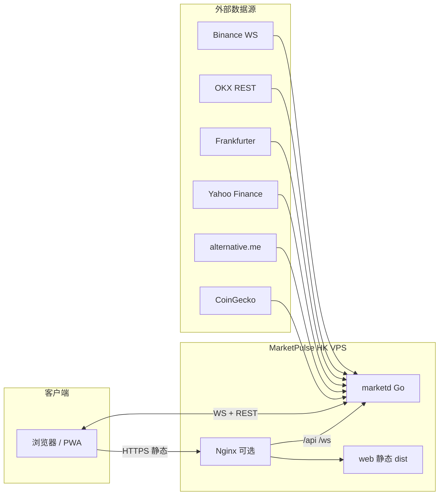
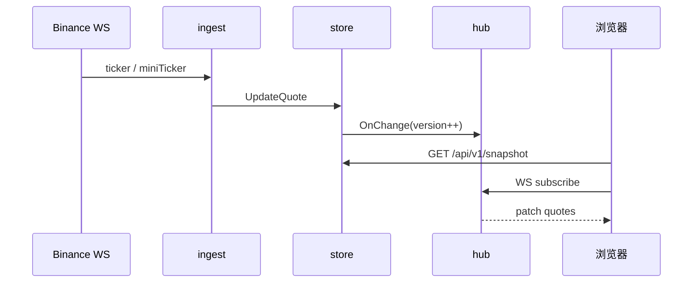

# RFC-001：MarketPulse 整体架构设计

| 字段 | 内容 |
|------|------|
| 状态 | Accepted（初版） |
| 作者 | — |
| 日期 | 2026-05-16 |
| 适用范围 | marketpulse 全栈（后端 marketd + 前端 web） |

---

## 1. 背景与目标

### 1.1 背景

旧系统（`go-coin-master` + `mine-web-master`）通过定时 REST 拉取火币行情写入 Redis，PHP 页面每秒轮询接口读缓存，存在延迟高、数据源脆弱、双服务维护成本高等问题。

### 1.2 目标

构建个人用加密货币行情看板 **MarketPulse**，满足：

1. **核心体验**：实时币价、汇率、股指、宏观指标（恐惧贪婪、总市值等）。
2. **技术升级**：币价经 **WebSocket 长连接** 入站，内存聚合后 **WebSocket/SSE** 推送前端，告别「REST → Redis → 轮询」。
3. **工程约束**：
   - **单一 Git 仓库**，目录区分前后端；
   - **前后端可独立构建、独立部署**（改前端不必强制重编后端）；
   - 适配 **Vibe Coding**（个人项目、AI 辅助迭代、约定清晰、文件边界明确）。

### 1.3 非目标（初版不做）

- 多用户注册/登录体系（MVP 可无鉴权或简单 Token）
- 资产记账、复杂预警、留言板、收藏夹（旧站 P2/P3 能力）
- 复刻 AiCoin / 非小号等非公开爬虫数据源

---

## 2. 设计原则

| 原则 | 说明 |
|------|------|
| **单仓双端** | 一个 repo：`/cmd` + `/internal` 为后端，`/web` 为前端 |
| **部署解耦** | 生产默认 **静态资源与 API 进程分离**；亦支持 **单二进制 embed** 一键部署 |
| **实时优先** | 币价路径：交易所 WS → 内存 Store → 客户端 WS |
| **慢数据 REST** | 股指、汇率、宏观指标按分钟级 REST 拉取即可 |
| **可观测** | `/healthz` 暴露各 ingest 连接状态 |
| **Vibe 友好** | 目录浅、命名一致、RFC/接口契约集中、Makefile 一键命令 |

---

## 3. 系统上下文



---

## 4. 逻辑架构

### 4.1 后端（marketd）

```
┌─────────────────────────────────────────────────────────┐
│ cmd/marketd                                              │
├─────────────────────────────────────────────────────────┤
│ internal/ingest/*     数据采集（WS 长连接 + REST 轮询）   │
│ internal/store        内存行情快照（线程安全）              │
│ internal/hub            WebSocket 广播（多客户端）          │
│ internal/api          REST 快照 / 健康检查                │
│ internal/config       配置加载（YAML + 环境变量）           │
└─────────────────────────────────────────────────────────┘
```

**数据流：**



### 4.2 前端（web）

```
┌─────────────────────────────────────────────────────────┐
│ web/ (Vue 3 + Vite + TypeScript)                         │
├─────────────────────────────────────────────────────────┤
│ src/api          REST / WS 客户端                        │
│ src/stores       Pinia 全局行情状态                       │
│ src/composables  useMarketStream 等                      │
│ src/components   QuoteTable / MacroGrid / IndexGrid …   │
│ src/views        Dashboard（MVP 单页）                    │
└─────────────────────────────────────────────────────────┘
```

**数据流：**

1. 挂载 → `GET /api/v1/snapshot` 填充首屏；
2. 连接 `WS /ws/v1/stream`；
3. 按 `type` + `version` 增量更新 Pinia；
4. 断线 → 指数退避重连 → 失败则降级 REST 轮询（带「非实时」提示）。

---

## 5. 仓库结构（Monorepo）

```
marketpulse/
├── README.md                 # 项目入口说明
├── Makefile                  # 统一构建/部署命令（Vibe 主入口）
├── .gitignore
├── go.mod
├── config/
│   └── config.example.yaml   # 配置模板
├── cmd/
│   └── marketd/
│       └── main.go           # 进程入口
├── internal/                 # 后端私有包（不对外 import）
│   ├── ingest/
│   ├── store/
│   ├── hub/
│   ├── api/
│   └── config/
├── web/                      # 前端工程
│   ├── package.json
│   ├── vite.config.ts
│   ├── index.html
│   └── src/
├── deploy/                   # 部署模板（非密钥）
│   ├── nginx.conf.example
│   ├── marketpulse.service.example
│   └── README.md
├── scripts/                  # 辅助脚本
│   └── check-connectivity.sh
└── docs/                     # 设计文档
    ├── README.md
    ├── RFC-001-architecture.md   # 本文
    ├── RFC-002-api-contract.md   # 预留：API/WS 契约
    └── RFC-003-deployment.md       # 预留：部署手册
```

**边界约定（Vibe Coding）：**

| 路径 | 允许改动 | 禁止 |
|------|----------|------|
| `internal/*` | 后端逻辑 | 引用 `web/` |
| `web/*` | 前端 UI/状态 | 直接访问数据库 |
| `docs/*` | 契约与 RFC | — |
| `deploy/*` | 部署模板 | 提交真实密钥 |

---

## 6. 技术选型

### 6.1 后端

| 项 | 选型 | 理由 |
|----|------|------|
| 语言 | **Go 1.22+** | 长连接、单二进制、低内存 |
| HTTP | **gin** | 轻量路由（已选定） |
| WS 服务端 | **gorilla/websocket** 或 **nhooyr.io/websocket** | 成熟稳定 |
| WS 客户端（交易所） | 标准库 / **gorilla** | Binance 明文 JSON |
| 配置 | **YAML + 环境变量覆盖** | 适合个人 VPS |
| 日志 | **slog** 标准库 | 零依赖 |
| 持久化 MVP | **无**（纯内存） | 降低复杂度 |

### 6.2 前端

| 项 | 选型 | 理由 |
|----|------|------|
| 框架 | **Vue 3** | 高频数字更新、组件化 |
| 构建 | **Vite 5** | 快、代理简单 |
| 语言 | **TypeScript** | 与 API 契约对齐 |
| 状态 | **Pinia** | 简单全局 store |
| 样式 | **UnoCSS 或 Tailwind** + CSS 变量 | 深色行情 UI、响应式 |
| 工具库 | **@vueuse/core** | WebSocket、可见性降频 |
| 表格（P1） | **Naive UI**（可选） | 深色主题 |

### 6.3 数据源（MVP）

| 数据 | 来源 | 方式 | 频率 |
|------|------|------|------|
| 现货价 BTC/ETH/… | Binance | WS `!miniTicker@arr` 或合并 stream | 实时 |
| USDT/CNY | OKX C2C REST | REST | 30–60s |
| USD/CNY | Frankfurter | REST | 1h |
| 股指 + 黄金 | Yahoo Finance | REST | 60–120s |
| 恐惧贪婪 | alternative.me | REST | 15min |
| 全局市值 | CoinGecko `/global` | REST | 5min |

> 火币 HTX WS 可作为 `ingest` 插件二期实现；MVP 以 Binance 为准。

---

## 7. API 与 WebSocket 契约（摘要）

> 完整字段定义见 `RFC-002-api-contract.md`（后续补齐）。

### 7.1 REST

| 方法 | 路径 | 说明 |
|------|------|------|
| GET | `/healthz` | 进程与各 ingest 健康状态 |
| GET | `/api/v1/snapshot` | 全量快照（首屏） |
| GET | `/api/v1/quotes` | 仅币价（可选） |
| GET | `/api/v1/indices` | 仅股指 |
| GET | `/api/v1/macro` | 宏观指标 |

### 7.2 WebSocket

- 路径：`GET /ws/v1/stream`
- 查询参数：`channels=quotes,indices,macro`（逗号分隔）
- 服务端推送 JSON：

```json
{
  "type": "quotes",
  "version": 1024,
  "ts": 1715850000000,
  "data": [ { "symbol": "BTC", "priceUsdt": 97000.1, "change24hPct": 1.2 } ]
}
```

- 心跳：服务端 ping / 客户端 pong（或应用层 `{"type":"ping"}`）

### 7.3 版本与兼容

- `snapshot.version` 与 WS `version` 单调递增；
- 前端忽略 `version` 小于本地的包；
- API 路径带 `/v1`，破坏性变更升 `/v2`。

---

## 8. 部署架构

### 8.1 推荐：双产物部署（改前端不必重编 Go）

```mermaid
flowchart TB
    subgraph vps [HK VPS]
        NX[Nginx :443]
        MD[marketd :8080]
        STATIC[/var/www/marketpulse/dist]
    end

    User --> NX
    NX -->|/ assets| STATIC
    NX -->|/api /ws /healthz| MD
```

| 产物 | 构建命令 | 部署目标 |
|------|----------|----------|
| 前端 | `make web` | `rsync web/dist → /var/www/marketpulse/` |
| 后端 | `make api` | `scp bin/marketd → /opt/marketpulse/` + systemd restart |

**优点：** 只改 CSS/组件时 **秒级发布静态**；后端迭代互不影响。

### 8.2 备选：单二进制 embed

- `make build`：`web/dist` embed 进 Go；
- 单文件 `marketd` + 单端口；
- 适合极简 VPS、无 Nginx。

由 `Makefile` 的 `DEPLOY_MODE=nginx|embed` 切换（见 `RFC-003-deployment.md`）。

### 8.3 开发环境

```bash
# 终端 1
make dev-api          # go run，:8080

# 终端 2
make dev-web          # vite，:5173，proxy /api /ws → 8080
```

---

## 9. 配置与环境

`config/config.yaml`（示例键）：

```yaml
app:
  addr: ":8080"
  mode: "release"          # debug | release

cors:
  allowed_origins: []      # 生产为空则同源；开发可填 http://localhost:5173

symbols:
  - BTC
  - ETH
  - BNB
  - LTC
  - FIL

ingest:
  binance:
    ws_url: "wss://stream.binance.com:9443/stream"
  otc:
    usdt_cny_interval: 30s
  forex:
    usd_cny_interval: 1h
  equity:
  interval: 90s
  macro:
    interval: 5m
```

环境变量覆盖示例：`MARKETPULSE_APP_ADDR=:8080`。

**密钥：** 不入库；`.env` 仅本地，列入 `.gitignore`。

---

## 10. 前端页面范围（MVP）

### P0 单页 Dashboard

1. **QuoteTable**：图标、币种、USDT/¥、当日%、24h%
2. **MacroGrid**：总市值、24h 成交额、恐惧贪婪、BTC 占比等
3. **IndexGrid**：上证/深证/恒生/道指/纳指/标普/黄金…
4. **StatusBar**：最后更新时间、WS 连接状态
5. **主题**：深色；红涨绿跌（`localStorage` 可切换）

### P1

- Tab：行情（排行榜表格）
- K 线抽屉：TradingView Widget
- 设置：自选币种（配置文件同步）

---

## 11. 可观测与运维

| 项 | 实现 |
|----|------|
| 健康检查 | `GET /healthz` → `{ "binance_ws": "ok", "last_quote_ts": ... }` |
| 日志 | JSON slog 到 stdout；systemd journal |
| 指标 MVP | 可选 `/debug/pprof`（仅 debug 模式开启） |
| 重启策略 | systemd `Restart=always`；WS 断线自动重连 |

---

## 12. 安全

| 项 | 策略 |
|----|------|
| 鉴权 MVP | 无或固定 query token（个人私密链接） |
| CORS | 生产仅同源；开发 Vite 代理 |
| TLS | Nginx 终止 HTTPS |
| 依赖 | `go mod verify`；`npm audit` 定期 |

---

## 13. Vibe Coding 协作约定

为便于 AI 与人类协作，约定如下：

1. **先改 RFC 再改契约**：破坏性 API 变更先更新 `docs/RFC-002-*.md`。
2. **单次 PR 范围**：要么 `internal/`，要么 `web/`，避免巨型 diff。
3. **Makefile 为真源**：文档中的命令以 `make help` 为准。
4. **组件命名**：`QuoteTable.vue` 对应 `Quote` 类型；后端 `store.Quote` 字段保持一致。
5. **不复制旧项目代码**：仅参考产品与字段，重写实现。
6. **提交信息**：`feat(web):` / `feat(api):` / `docs:` 前缀。

---

## 14. 里程碑

| 阶段 | 交付 | 预估 |
|------|------|------|
| **M0** | 仓库骨架 + RFC + Makefile + 连通性脚本 | 当前 |
| **M1** | Binance ingest + snapshot API + WS hub | — |
| **M2** | Vue Dashboard P0 + dev 代理联调 | — |
| **M3** | Nginx 双产物部署文档 + HK 上线 | — |
| **M4** | 股指/宏观 ingest + IndexGrid | — |
| **M5** | 排行榜、K 线、设置页 P1 | — |

---

## 15. 风险与对策

| 风险 | 对策 |
|------|------|
| Binance 在香港偶发不稳定 | 备用 OKX WS ingest；健康检查告警 |
| Yahoo 封 IP | Stooq 备用源；降低频率 |
| 前后端字段漂移 | RFC-002 + TS 类型与 Go struct 同步维护 |
| embed 模式前端发布慢 | 默认推荐 nginx 静态分离 |

---

## 16. 未决问题

- [ ] Ahr999 指标是否在 M1 自算或延后
- [ ] 是否需 SQLite 存日 K 日历（P1）
- [x] HTTP 框架：**gin**

---

## 17. 参考

- 旧站页面：`mine-web-master/view/index/index.html`
- 旧后端采集：`go-coin-master/crontab/`
- [Binance WebSocket Streams](https://developers.binance.com/docs/binance-spot-api-docs/web-socket-streams)

---

## 修订记录

| 版本 | 日期 | 说明 |
|------|------|------|
| 0.1 | 2026-05-16 | 初稿 |
